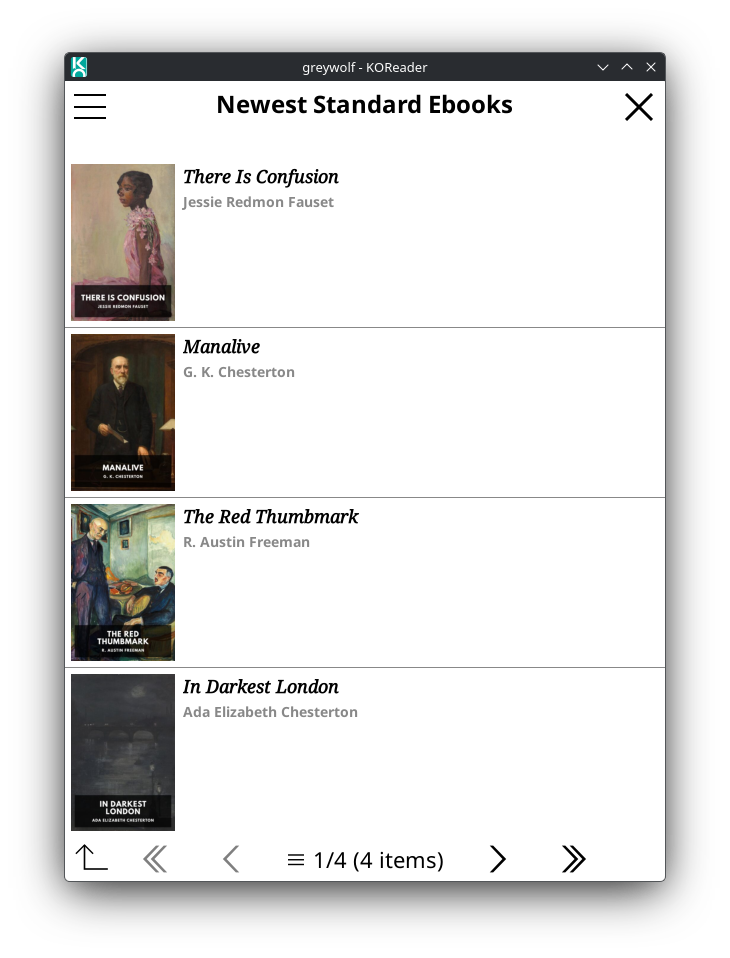
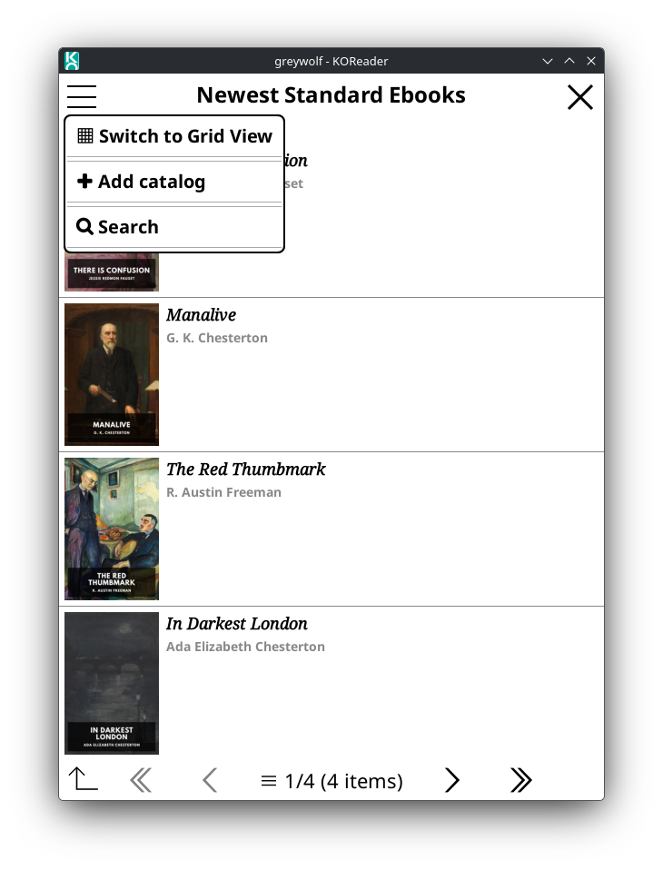
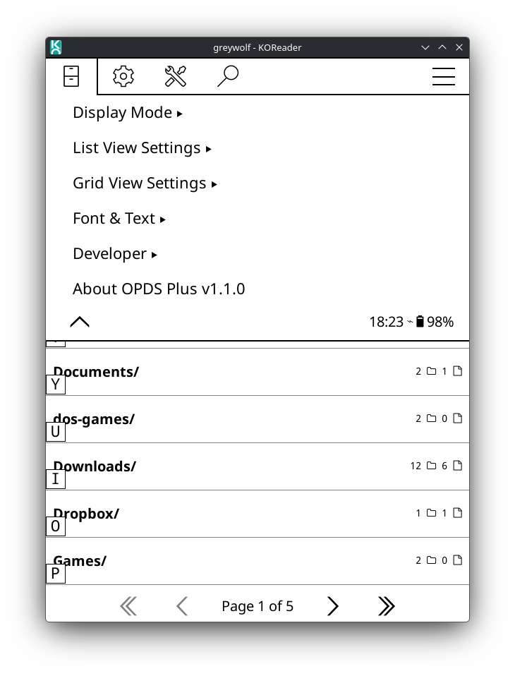

# OPDS Plus - Enhanced OPDS Browser for KOReader

**Version:** 1.1.0

**OPDS Plus** is a feature-rich enhancement of KOReader's built-in OPDS catalog browser, providing visual book cover displays, multiple viewing modes, and extensive customization options for browsing online book catalogs.

## ✨ Features

### 📚 Enhanced Catalog Browsing
- **Visual Book Covers**: Browse catalogs with book cover images displayed alongside titles
- **Dual View Modes**: Switch between List View and Grid View layouts
- **Multiple Display Options**: Customize how books are presented

### 🖼️ List View
- Book covers displayed alongside title and author information
- Adjustable cover sizes with presets (Compact, Regular, Large, Extra Large)
- Custom size option (5-25% of screen height)
- Clean, readable layout optimized for e-readers

### 📊 Grid View
- Display books in a grid layout for visual browsing
- Flexible column options (2-4 columns)
- Layout presets: Compact (4 cols), Balanced (3 cols), Spacious (2 cols)
- Customizable grid borders:
  - No Borders: Clean, borderless grid
  - Hash Grid: Shared borders in a # pattern
  - Individual Tiles: Each book has its own border
- Adjustable border thickness (1-5px) and color (Light Gray, Dark Gray, Black)

### 🎨 Customization Options
- **Font Selection**: Choose from KOReader's built-in fonts or your custom fonts
- **Independent Font Settings**: Separate customization for titles and details
  - Font family selection
  - Font size adjustment
  - Bold/regular weight toggle
  - Color options (Dark Gray, Black)
- **Same Font Mode**: Option to use matching fonts for consistent appearance
- **Persistent Settings**: All preferences are saved between sessions

### 📖 Default Catalogs Included
- Project Gutenberg
- Standard Ebooks
- ManyBooks
- Internet Archive
- textos.info (Spanish)
- Gallica (French)

## 📸 Screenshots

|                        **List View**                        |                        **Grid View**                        |
| :---------------------------------------------------------: | :---------------------------------------------------------: |
|  |  |
|          *Classic list view with cover thumbnails*          |            *Immersive grid layout for browsing*             |

|                       **View Options**                        |                    **Customization**                    |
| :-----------------------------------------------------------: | :-----------------------------------------------------: |
|  |  |
|             *Switch views instantly via the menu*             |            *Extensive customization options*            |

## 📥 Installation

### Method 1: Manual Installation (Recommended)

1. **Download the latest release**:
   - Go to the [Releases](https://github.com/greywolf1499/opds_plus.koplugin/releases) page
   - Download the `opds_plus.koplugin.zip` file from the latest release

2. **Extract to KOReader plugins directory**:

   The location depends on your device:

   - **Kindle/Kobo/Android**: Extract to `/koreader/plugins/`
   - **Linux**: Extract to `~/.config/koreader/plugins/`
   - **Windows**: Extract to `%APPDATA%/koreader/plugins/`
   - **macOS**: Extract to `~/Library/Application Support/koreader/plugins/`

   The archive should extract to create an `opds_plus.koplugin` directory containing all plugin files.

3. **Restart KOReader**: Close and reopen KOReader to load the plugin

4. **Verify installation**:
   - Open KOReader's File Browser
   - Tap the menu icon (⋮ or ≡)
   - You should see "OPDS Plus Catalog" in the menu

### Method 2: Git Clone (For Developers)

```bash
# Navigate to KOReader plugins directory
cd ~/.config/koreader/plugins/  # Adjust path for your system

# Clone the repository
git clone https://github.com/greywolf1499/opds_plus.koplugin.git

# Restart KOReader
```

### Troubleshooting Installation
- Ensure the directory is named exactly `opds_plus.koplugin`
- Verify all `.lua` files are present in the plugin directory
- Check that you have write permissions to the plugins directory
- If the plugin doesn't appear, check KOReader's crash.log for errors

## 🚀 Usage

### Accessing OPDS Plus

1. Open KOReader's **File Browser**
2. Tap the **menu icon** (⋮ or ≡)
3. Select **OPDS Plus Catalog**

### Browsing Catalogs

#### First Time Setup
- The plugin comes with several default catalogs pre-configured
- Simply select a catalog to start browsing

#### Browsing Books
1. Select a catalog from the list
2. Navigate through categories and books
3. Tap a book to view details and download options
4. Downloaded books are saved to your configured download directory

### Customizing Settings

Access settings from: **OPDS Plus Catalog → Settings**

#### Display Mode
- **List View**: Traditional list with covers on the left
- **Grid View**: Visual grid layout with larger covers

#### List View Settings
- **Cover Size**: Choose from presets or set custom size
  - Compact (8%): More books per page
  - Regular (10%): Default balanced view
  - Large (15%): Easier to see cover details
  - Extra Large (20%): Maximum cover visibility
  - Custom: Fine-tune between 5-25%

#### Grid View Settings
- **Grid Layout**:
  - Compact: 4 columns, more books visible
  - Balanced: 3 columns, good middle ground (default)
  - Spacious: 2 columns, larger covers
  - Custom: Manual column selection (2-4)

- **Grid Borders**:
  - Style: None, Hash Grid, or Individual Tiles
  - Thickness: 1-5 pixels
  - Color: Light Gray, Dark Gray, or Black

#### Font & Text Settings
- **Use Same Font for All**: Match title and detail fonts
- **Title Settings**:
  - Font family
  - Font size (12-24pt)
  - Bold/regular weight
- **Information Settings**:
  - Font family (independent if same font disabled)
  - Font size (10-20pt)
  - Bold/regular weight
  - Color: Dark Gray or Black

### Adding Your Own Catalogs

1. Go to **OPDS Plus Catalog → Settings → Manage Catalogs**
2. Select **Add Catalog**
3. Enter:
   - Catalog name
   - OPDS feed URL
4. The new catalog will appear in your catalog list

## 🔧 Technical Details

### Requirements
- KOReader v2021.04 or later
- Network connectivity for browsing online catalogs

### File Structure
```
opds_plus.koplugin/
├── _meta.lua                 # Plugin metadata
├── main.lua                  # Main plugin initialization and settings
├── opdsbrowserplus.lua       # Catalog browser logic
├── opdslistmenuplus.lua      # List view implementation
├── opdsgridmenuplus.lua      # Grid view implementation
├── opdscovermenuplus.lua     # Cover display components
├── opdsparser.lua            # OPDS feed parsing
├── opdspse.lua               # Page state engine
├── image_loader.lua          # Cover image loading
└── url_content.lua           # Network content fetching
```

### Settings Storage
Settings are stored in: `<KOReader data dir>/settings/opdsplus.lua`

This file contains:
- Catalog list
- Download history
- Display preferences
- Font settings
- Grid layout configuration

## 🤝 Contributing

Contributions are welcome! Here's how you can help:

1. **Report Bugs**: Open an issue describing the problem
2. **Suggest Features**: Share your ideas via GitHub issues
3. **Submit Pull Requests**:
   - Fork the repository
   - Create a feature branch
   - Make your changes
   - Submit a PR with a clear description

### Development Guidelines
- Follow KOReader's Lua coding conventions
- Test on multiple screen sizes if possible
- Ensure compatibility with existing OPDS catalogs
- Document new features in the README

## 📝 Known Issues & Limitations

- Cover loading depends on catalog providing image URLs
- Some OPDS feeds may not include cover images
- Large catalogs may take time to load initially
- Grid view performance varies with device capabilities

## 🙏 Credits

- **Original OPDS Plugin**: KOReader development team
- **Enhancement Development**: greywolf1499
- Built upon the excellent [KOReader](https://github.com/koreader/koreader) e-reader software

## 📜 License

This plugin is released under the same license as KOReader: **GNU Affero General Public License v3.0 (AGPL-3.0)**

See the [LICENSE](LICENSE) file for details.

## 📞 Support

- **Issues & Bug Reports**: [GitHub Issues](https://github.com/greywolf1499/opds_plus.koplugin/issues)
- **KOReader Documentation**: [KOReader Wiki](https://github.com/koreader/koreader/wiki)
- **OPDS Specification**: [OPDS Spec](https://specs.opds.io/)

## 🔄 Version History

See [CHANGELOG.md](CHANGELOG.md) for detailed version history.

---

**Enjoy enhanced OPDS browsing with OPDS Plus! 📚✨**
